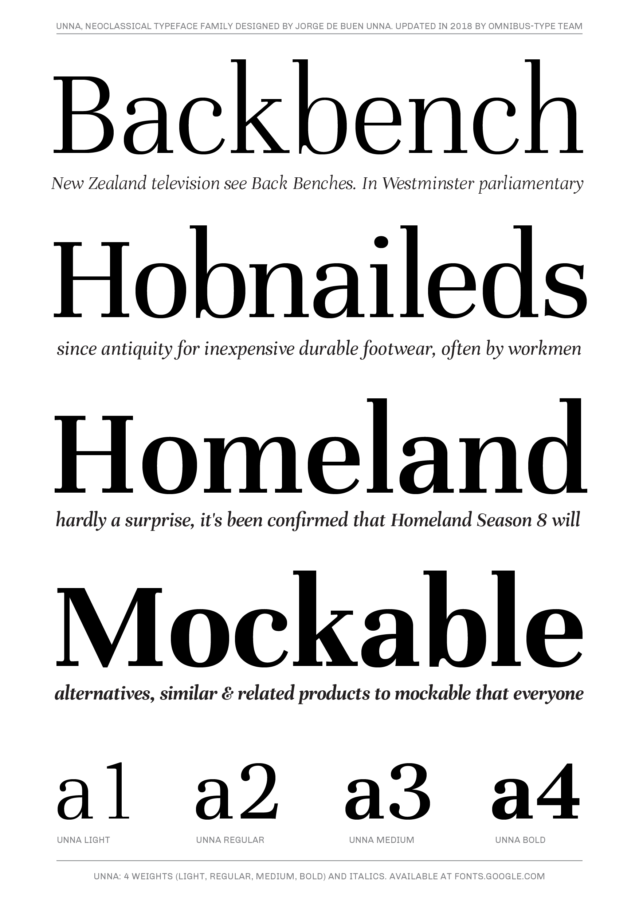
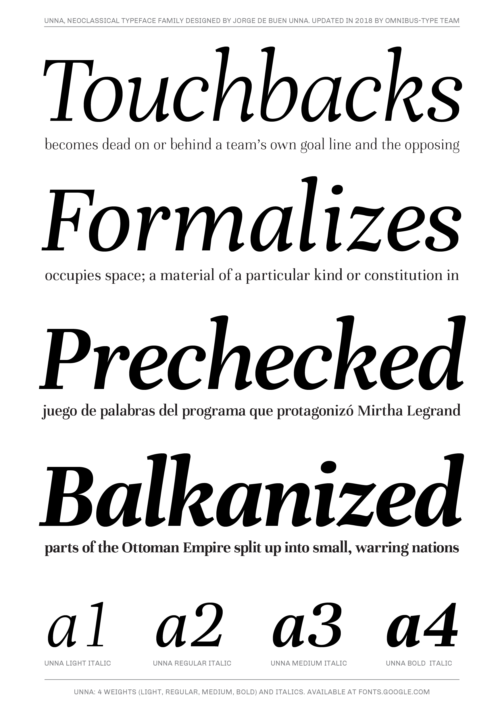

# Unna family

**De Buen & Omnibus-Type Team**
*SIL Open Font License 1.1 / *
*8 fonts, 844 glyphs each variant / *
*Tipos Latinos 2012*

Unna is a transitional typeface, with 4 weight variants, plus matching italics. Its visual character has a neoclassical vertical texture, but Unna shows its own tenderness, through delicate serifs and strong stems. Therefore it is great for literature books. It was designed by Jorge de Buen, who was inspired by his mother’s surname, and developed by the Omnibus-Type Team.

#### Unna Family contains:
* light / light italic
* regular / italic
* medium / medium italic
* bold / bold italic

To contribute to the project contact [Omnibus Type](http://omnibus-type.com/).

### Designers

* Jorge de Buen
* Pablo Cosgaya and Nicolás Silva [italic version]

### License

Copyright (c) 2019, Omnibus-Type (www.omnibus-type.com | omnibus.type@gmail.com).

Licensed under the [*SIL Open Font License, 1.1*](http://scripts.sil.org/OFL); you may not use this file except in compliance with the License.

======
## FONTLOG for the Unna fonts

This file provides detailed information on the Unna and Unna One font software.  
This information should be distributed along with the Unna fonts and any derivative works.

### Unna is a typeface family that supports Unicode language range: 

* Basic Latin 			  U+0020-U+007E
* Latin-1 Supplement  U+00A0-U+00FF
* Latin Extended-A 		U+0100-U+017F

**Character map to support MS Codepages:**
* 1252 Latin-1
* 1250 Latin-2 (Easter Europe)
* 1254 Turkish
* 1257 Windows Baltic
* Mac Roman

*To contribute to the project contact Omnibus-Type at omnibus.type@gmail.com*

**31 Oct 2018 (Omnibus-Type) Unna family v.2.008**
- New weights: light, light italic, medium and medium italic
- Updated to GF Latin Plus set
- Supports 219 Latin languages used in 212 countries

**6 Dec 2016 (Marc Foley) Unna family v2.007**
- Unna v2.007 released

**28 Jan 2015 (Omnibus-Type) Unna regular, italic, bold and bolditalic v.2.006**  
- Removed Reserve Font Name from the license
- Name tables adjusted
- fsType Installable Mode
- Set Panose values
- Updates CFF and TTF hinting
- Added Family Alignment Zones
- New Verical Metrics

**11 Jun 2014 (Omnibus-Type) Unna regular, italic, bold and bolditalic v.2.005**
- Redrew numbers and other glyphs:  
    - onenehalf, onequarter, threequarters, florin, percent, perthousand, product, summation, copyright, estimated, literSign, registered.
- Improved kerning in Uppercase next to lowercases
- Improved contextual ligatures OT feature
- Drew bold and bolditalic versions
- TTF Autohint 1.0
- Optimized TTF curves

**25 Dec 2013 (Omnibus-Type) Unna regular and italic v.2.004**
- Drew italic lowercase versions
- Expanded character map to support Unicode language ranges:

Block              | Range
-------------------|--------------
Basic Latin        | U+0020-U+007E
Latin-1 Supplement | U+00A0-U+00FF
Latin Extended-A   | U+0100-U+017F

- Character map to support MS Codepages:  
  - 1252 Latin-1
  - 1250 Latin-2 (Easter Europe)
  - 1254 Turkish
  - 1257 Windows Baltic
  - Mac Roman
- Improved CFF hint (AFDK Autohint 2.4)
- Improved TTF hint (TTFAutohint 0.97)
- Updated and expanded features in OT Tables:
  - GSUB:
    * **aalt** Access All Alternatives
    * **locl** Localized Forms
    * **sups** SuperScript
    * **frac** Diagonal Fractions
    * **ordn** Ordinals
    * **calt** Contextual Alternatives
    * **liga** Standar Ligatures
    * **ss01** Style Set 1
    * **salt** Stylistic Alternatives
      * Single Substitution
      * Ligature Substitution
  - GPOS:
    * **cpsp** Capital Spacing
    * **kern** Horizontal Kerning (triplets)

**12 Jul 2011 (Jorge de Buen U.) Unna  v2.002**
- Initial release under SIL Open Font License  
This release supports the following:  
- Unicode ranges: Latin-1

### Acknowledgements

If you make modifications be sure to add your name (N), email (E), web-address
(if you have one) (W) and description (D). This list is in alphabetical order.

**N:** **Igino Marini**  
**E:** mail@iginomarini.com  
**W:** http://www.ikern.com  
**D:** Spacing and Kerning

**N:** **Jorge de Buen**  
**E:** omnibus.type@gmail.com  
**W:** http://www.omnibus-type.com  
**D:** Designer

**N:** **Nicolás Silva**  
**E:** omnibus.type@gmail.com  
**W:** http://www.omnibus-type.com  
**D:** Typeface development

**N:** **Yorlmar Campos**  
**E:** omnibus.type@gmail.com  
**W:** http://www.omnibus-type.com  
**D:** Typeface development 
